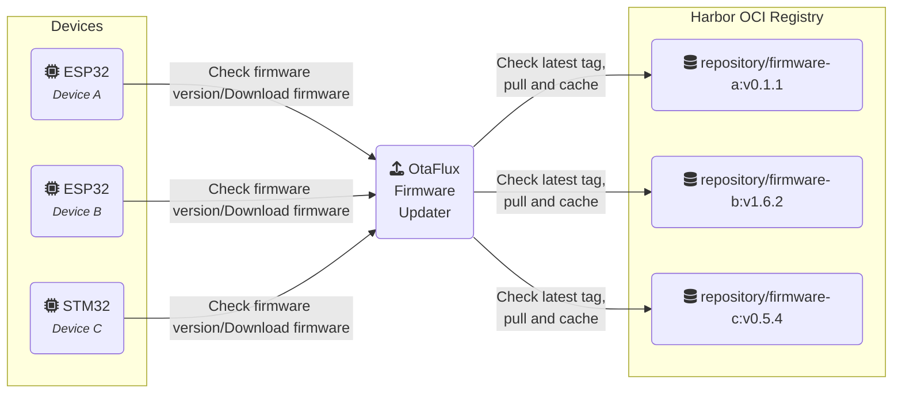

# OtaFlux - OTA Firmware Updater (through OCI registry)

> An OTA (Over-the-Air) firmware update server that fetches, caches, and serves
> firmware binaries from an OCI-compatible container registry.

OtaFlux enables IoT devices (like ESP32 or STM32) to fetch firmware updates
without complex orchestration. Devices periodically query the server, which
checks the latest semver tag in a remote [OCI][oci] registry (such as
[Harbor][harbor]), pulls the firmware image, extracts the binary, computes its
CRC and size, caches it, and serves it on demand. It is designed to be simple,
cache-efficient, and registry-agnostic.

## Overview



## Features

- Pulls firmware directly from an OCI registry (Docker, Harbor, etc.)
- Per-device firmware discovery using semver tags
- Caches firmware with version, CRC32, and size metadata
- HTTP endpoints for version, firmware binary, and health checks
- Support code signing verification of firmware OCI artifacts through [Sigstore
Cosign][sigstore]

## Getting Started

### Prerequisites

- OCI-compatible registry (e.g., [Harbor][harbor])
- Container engine (optional, for containerized deployment, e.g.
[Docker][docker], [Podman][podman], etc.)

### Container image

```bash
podman run -ti --rm \
    -p 8080:8080 \
    -p 9090:9090 \
    ghcr.io/etiennetremel/otaflux otaflux \
        --log-level "debug" \
        --registry-url "https://your-registry.example.com" \
        --repository-prefix "my-project/" \
        --registry-username "username" \
        --registry-password "password"
```

**Note**: You can also use environment variable to set values of the CLI flag,
e.g. `REGISTRY_URL`.

### Development

```bash
cargo run -- \
    --log-level "debug" \
    --registry-url "https://your-registry.example.com" \
    --repository-prefix "my-project/" \
    --registry-username "username" \
    --registry-password "password"
```

### Deploy to Kubernetes using Helm

The OtaFlux Helm Chart is stored as OCI artifact in GitHub Container Registry.
You can install it using the command below:

```bash
# make sure to include the latest helm chart version from the release page
helm install \
    otaflux \
    oci://ghcr.io/etiennetremel/helm-charts/otaflux \
    --version v0.1.0
```

## HTTP API

- `GET /health`: Health check.
- `GET /version?device=<device id>`: Returns the latest version available for a
  given device, CRC32 and firmware size, such as:
  ```
  0.1.1
  4051932293
  942320
  ```
- `GET /firmware?device=<device id>`: Serves the firmware binary.

## Example IoT Integration

See [etiennetremel/esp32-home-sensor][esp32-home-sensor] for an example ESP32
device that performs OTA updates using this server.

## Example Infrastructure Setup

For provisioning and registry infrastructure, check
[etiennetremel/homie-lab][homie-lab].

## Firmware OCI-artifact verification through CodeSign

OtaFlux supports firmware image signing using Cosign, a tool from the Sigstore
ecosystem designed to sign and verify container images and other OCI artifacts.

### Why this matters

Distributing firmware over-the-air introduces risks. A compromised registry, a
man-in-the-middle attack, or accidental deployment of an unverified build can
all lead to bricked devices or worse: remote code execution. Firmware
authenticity must be verifiable before an update is accepted.

Cosign provides:
- Cryptographic integrity checks using signatures tied to a specific image
digest.
- Optional transparency logs via Rekor, which publicly record signing events
for later auditing.
- Standard tooling that works with any OCI-compliant registry (Harbor, GitHub
Container Registry, etc).

**OtaFlux verifies signatures before serving firmware to a device, so unsigned
or
tampered images are automatically rejected.**

### Workflow workflow with CoSign

First, you will need both the [Cosign CLI][cosign-cli] and [oras CLI][oras].


Then you will need to generate a cosign key-pair which will be used to sign the
image and have [OtaFlux][otaflux] verify the image using the public key.

```bash
# Generate key pair, this generate a cosign.pub and cosign.key. You can leave
# the password empty. Make sure to keep both key in a safe environment (e.g.
# KMS).
cosign generate-key-pair
```

Build a firmware image using your tool of choice, below is an example to build
and convert to a binary image using [espflash][espflash] for ESP based chips:

```bash
# required for esp worflow
. $HOME/export-esp.sh

# compile project
cargo build --release

# save as binary image
espflash save-image \
    --chip esp32 \
    ./target/xtensa-esp32-none-elf/release/my-device \
    ./firmware.bin

# push the firmware binary image to an OCI registry
oras push "my-registry.example.com:443/my-project/my-device:0.1.2" \
    firmware.bin:application/vnd.espressif.esp32.firmware.v1+binary
```

Sign the artifact using [Cosign][cosign-cli]:

```bash
# Sign the artifact (you will nee the sha256 digest of the image)
cosign sign --key cosign.key \
  registry.example.com:443/my-project/esp32-outdoor@sha256:<digest>

# Optionally, you can also verify the artifact has been correctly signed:
cosign verify --key cosign.pub \
  registry.example.com:443/my-project/esp32-outdoor@sha256:<digest>
```

Then in OtaFlux, you will need to pass the `cosign.pub` public key. If a key is
provided to OtaFlux, it will automatically proceed with signature verification.

```bash
podman run -ti --rm \
    -v $PWD/cosign.pub:/etc/otaflux/cosign.pub \
    -p 8080:8080 \
    -p 9090:9090 \
    otaflux \
        --log-level "debug" \
        --registry-url "https://your-registry.example.com" \
        --repository-prefix "my-project/" \
        --registry-username "username" \
        --registry-password "password" \
        --cosign-pub-key-path "/etc/otaflux/cosign.pub"
```

You can now test:

```bash
curl 'localhost:8080/version?device=my-device'
0.1.1
2258256831
953968
```

If the verification doesn't work, it returns an error.

<!-- page links -->
[cosign-cli]: https://docs.sigstore.dev/cosign/system_config/installation/
[docker]: https://www.docker.com
[esp32-home-sensor]: https://github.com/etiennetremel/esp32-home-sensor
[espflash]: https://github.com/esp-rs/espflash
[harbor]: https://goharbor.io
[homie-lab]: https://github.com/etiennetremel/homie-lab
[oci]: https://opencontainers.org
[oras]: https://oras.land
[podman]: https://podman.io
[sigstore]: https://www.sigstore.dev
