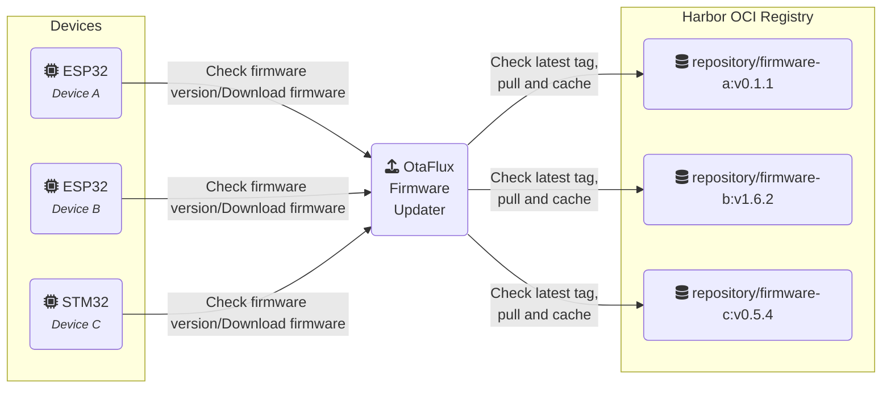

# OtaFlux - OTA Firmware Updater (through OCI registry)

> An OTA (Over-the-Air) firmware update server that fetches, caches, and serves
> firmware binaries from an OCI-compatible container registry.

OtaFlux enables IoT devices (like ESP32 or STM32) to fetch firmware updates
without complex orchestration. Devices periodically query the server, which
checks the latest semver tag in a remote [OCI][oci] registry (such as
[Harbor][harbor]), pulls the firmware image, extracts the binary, computes its
CRC and size, caches it, and serves it on demand. It is designed to be simple,
cache-efficient, and registry-agnostic.

## Overview



## Features

- Pulls firmware directly from an OCI registry (Docker, Harbor, etc.)
- Per-device firmware discovery using semver tags
- Caches firmware with version, CRC32, and size metadata
- Supports compressed firmware (gzip, zstd, tar archives)
- HTTP endpoints for version, firmware binary, and health checks

## Getting Started

### Prerequisites

- Docker (optional, for containerized deployment)
- OCI-compatible registry (e.g., [Harbor][harbor])

### Environment Variables

Set the following variables before running:

```env
REGISTRY_URL=https://your-registry.example.com
REPOSITORY_PREFIX=my-username/
REGISTRY_USERNAME=youruser
REGISTRY_PASSWORD=yourpass
LISTEN_ADDR=0.0.0.0:8080
```

### Container image

```bash
podman build -t otaflux .
podman run -ti --rm --env-file $PWD/config.env -p 8080:8080 otaflux
```

### Development

```bash
cargo run
```

## HTTP API

- `GET /health`: Health check.
- `GET /version?device=<device id>`: Returns the latest version available for a
  given device, CRC32 and firmware size, such as:
  ```
  0.1.1
  4051932293
  942320
  ```
- `GET /firmware?device=<device id>`: Serves the firmware binary.

## Example IoT Integration

See [etiennetremel/esp32-home-sensor][esp32-home-sensor] for an example ESP32
device that performs OTA updates using this server.

## Example Infrastructure Setup

For provisioning and registry infrastructure, check [etiennetremel/homie-lab][homie-lab].

<!-- page links -->
[homie-lab]: https://github.com/etiennetremel/homie-lab
[esp32-home-sensor]: https://github.com/etiennetremel/esp32-home-sensor
[oci]: https://opencontainers.org
[harbor]: https://goharbor.io
