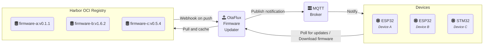

# OtaFlux - OTA Firmware Updater (through OCI registry)

> An OTA (Over-the-Air) firmware update server that fetches, caches, and serves
> firmware binaries from an OCI-compatible container registry.

OtaFlux enables IoT devices (like ESP32 or STM32) to fetch firmware updates
without complex orchestration. Devices periodically query the server, which
checks the latest semver tag in a remote [OCI][oci] registry (such as
[Harbor][harbor]), pulls the firmware image, extracts the binary, computes its
CRC and size, caches it, and serves it on demand.

## Overview



## Features

- Pull firmware directly from OCI registries (Docker, Harbor, etc.)
- Per-device firmware discovery using semver tags
- Cache firmware with version, CRC32, and size metadata
- [MQTT notifications](docs/mqtt.md) for push-based update triggers
- [Harbor webhook integration](docs/webhooks.md) for instant cache refresh
- [Cosign signature verification](docs/cosign.md) for firmware authenticity

## Quick Start

```bash
podman run -ti --rm \
    -p 8080:8080 \
    -p 9090:9090 \
    ghcr.io/etiennetremel/otaflux \
        --registry-url "https://your-registry.example.com" \
        --repository-prefix "my-project/" \
        --registry-username "username" \
        --registry-password "password"
```

Query firmware version:

```bash
curl 'localhost:8080/version?device=my-device'
# Returns: version, CRC32, size
0.1.1
4051932293
942320
```

Download firmware:

```bash
curl -o firmware.bin 'localhost:8080/firmware?device=my-device'
```

## Documentation

| Document | Description |
|----------|-------------|
| [Configuration](docs/configuration.md) | CLI options, environment variables, and API reference |
| [MQTT Notifications](docs/mqtt.md) | Push-based update notifications via MQTT |
| [Harbor Webhooks](docs/webhooks.md) | Webhook integration for Harbor registry |
| [Cosign Verification](docs/cosign.md) | Firmware signing and verification |

## Deployment

### Getting Started

This project uses [mise](https://mise.jdx.dev/) to manage development tools.
After [installing mise](https://mise.jdx.dev/getting-started.html), run:

```bash
# Install Rust and other tools defined in mise.toml
mise install
```

### Development

```bash
cargo run -- \
    --log-level "debug" \
    --registry-url "https://your-registry.example.com" \
    --repository-prefix "my-project/" \
    --registry-username "username" \
    --registry-password "password"
```

### Testing

Run unit tests:

```bash
cargo test
```

Run end-to-end tests (requires Docker/Podman for testcontainers):

```bash
cargo test --test webhook_test
```

The e2e tests use [testcontainers](https://testcontainers.com/) to spin up a
real Mosquitto MQTT broker and [wiremock](https://wiremock.rs/) to mock the OCI
registry. This tests the full flow: Harbor webhook → OCI registry fetch → MQTT
publish.

### Kubernetes (Helm)

```bash
helm install otaflux \
    oci://ghcr.io/etiennetremel/helm-charts/otaflux \
    --version v0.1.0
```

## Examples

- **IoT Integration**: [etiennetremel/esp32-home-sensor][esp32-home-sensor] -
  ESP32 device performing OTA updates using OtaFlux
- **Infrastructure Setup**: [etiennetremel/homie-lab][homie-lab] - Registry and
  infrastructure provisioning

## License

See [LICENSE](LICENSE) for details.

<!-- page links -->
[docker]: https://www.docker.com
[esp32-home-sensor]: https://github.com/etiennetremel/esp32-home-sensor
[harbor]: https://goharbor.io
[homie-lab]: https://github.com/etiennetremel/homie-lab
[oci]: https://opencontainers.org
[podman]: https://podman.io
