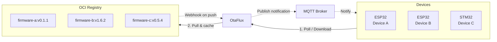

# OtaFlux - OTA Firmware Updater (through OCI registry)

[](https://github.com/etiennetremel/otaflux/actions/workflows/build.yaml)
[](https://opensource.org/licenses/MIT)
[](https://github.com/etiennetremel/otaflux/pkgs/container/helm-charts%2Fotaflux)

> OTA firmware update server that serves binaries from OCI registries.

OtaFlux lets IoT devices (ESP32, STM32, etc.) fetch firmware updates without
complex orchestration. It pulls the latest semver-tagged image from an
[OCI][oci] registry (Harbor, GHCR, etc.), extracts the binary, computes CRC32
and size, caches it, and serves it on demand.

## Overview



### How It Works

1. **Device polls OtaFlux** - Devices query `/version?device=<id>` to check for updates
2. **OtaFlux fetches from registry** - On first request or cache miss, OtaFlux pulls the latest semver-tagged image from the OCI registry
3. **Firmware is cached** - Binary is extracted, CRC32 computed, and cached in memory
4. **Device downloads firmware** - If a newer version is available, device fetches the binary from `/firmware?device=<id>`
5. **(Optional) Push notifications** - When Harbor webhooks are configured, OtaFlux publishes MQTT notifications immediately after new images are pushed

## Features

- **OCI registry support** - Pull firmware from Docker, Harbor, GHCR, etc.
- **Semver tag discovery** - Automatically selects the latest version per device
- **Caching** - Stores firmware with version, CRC32, and size metadata
- **[MQTT notifications](docs/mqtt.md)** - Push-based update triggers
- **[Harbor webhooks](docs/webhooks.md)** - Instant cache refresh on push
- **[Cosign verification](docs/cosign.md)** - Cryptographic signature checks

## Quick Start

```bash
podman run -ti --rm \
    -p 8080:8080 \
    -p 9090:9090 \
    ghcr.io/etiennetremel/otaflux \
        --registry-url "https://your-registry.example.com" \
        --repository-prefix "my-project/" \
        --registry-username "username" \
        --registry-password "password"
```

Query the latest firmware version:

```bash
curl 'localhost:8080/version?device=my-device'
# Returns: version, CRC32, size
0.1.1
4051932293
942320
```

Download the firmware binary:

```bash
curl -o firmware.bin 'localhost:8080/firmware?device=my-device'
```

## Documentation

| Document | Description |
|----------|-------------|
| [Configuration](docs/configuration.md) | CLI options, environment variables, and API reference |
| [Architecture](docs/architecture.md) | Technical deep-dive on caching, concurrency, and components |
| [MQTT Notifications](docs/mqtt.md) | Push-based update notifications via MQTT |
| [Harbor Webhooks](docs/webhooks.md) | Webhook integration for Harbor registry |
| [Cosign Verification](docs/cosign.md) | Firmware signing and verification |

## Deployment

### Prerequisites

This project uses [mise](https://mise.jdx.dev/) to manage development tools.
After [installing mise](https://mise.jdx.dev/getting-started.html):

```bash
mise install
```

### Development

```bash
cargo run -- \
    --log-level "debug" \
    --registry-url "https://your-registry.example.com" \
    --repository-prefix "my-project/" \
    --registry-username "username" \
    --registry-password "password"
```

### Testing

```bash
cargo test
```

The test suite covers:
- Health endpoint
- Version endpoint and semver tag selection
- Firmware download and caching
- Harbor webhook integration with MQTT (requires Docker/Podman)

Tests use [wiremock](https://wiremock.rs/) to mock the OCI registry and
[testcontainers](https://testcontainers.com/) for a real Mosquitto broker.

For verbose output:

```bash
RUST_LOG=debug cargo test -- --nocapture
```

### Kubernetes

```bash
helm install otaflux \
    oci://ghcr.io/etiennetremel/helm-charts/otaflux \
    --version v0.1.0
```

## Examples

- [etiennetremel/esp32-home-sensor][esp32-home-sensor] - ESP32 device using
  OtaFlux for OTA updates
- [etiennetremel/homie-lab][homie-lab] - Registry and infrastructure setup

## Troubleshooting

### Common Issues

| Issue | Cause | Solution |
|-------|-------|----------|
| `No firmware for device 'X'` | Device not found in registry or no semver tags | Verify the repository exists and has tags like `v1.0.0`, `1.0.0` |
| `401 Unauthorized` | Invalid registry credentials | Check `REGISTRY_USERNAME` and `REGISTRY_PASSWORD` |
| Connection refused | OtaFlux not reachable | Verify `--listen-addr` and firewall rules |
| MQTT not publishing | MQTT URL not configured or broker unreachable | Check `--mqtt-url` and broker connectivity |
| Signature verification failed | Invalid or missing cosign signature | Ensure artifact is signed with the correct key |

### Debug Mode

Enable debug logging to diagnose issues:

```bash
otaflux --log-level debug ...
# or
LOG_LEVEL=debug otaflux ...
```

### Health Check

Verify OtaFlux is running:

```bash
curl http://localhost:8080/health
# Returns: 200 OK
```

## License

See [LICENSE](LICENSE).

<!-- page links -->
[esp32-home-sensor]: https://github.com/etiennetremel/esp32-home-sensor
[homie-lab]: https://github.com/etiennetremel/homie-lab
[oci]: https://opencontainers.org
