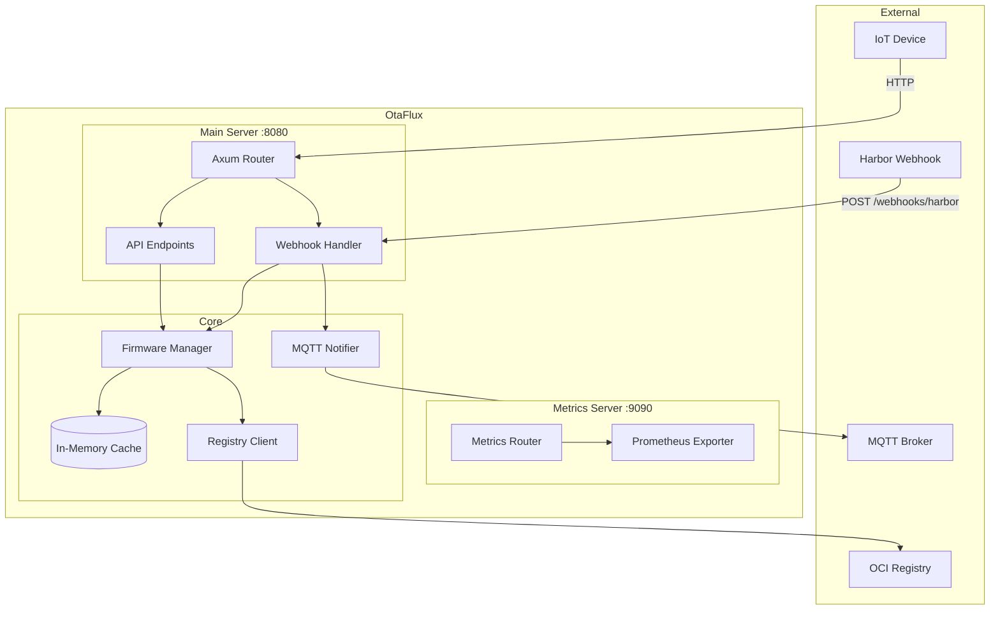
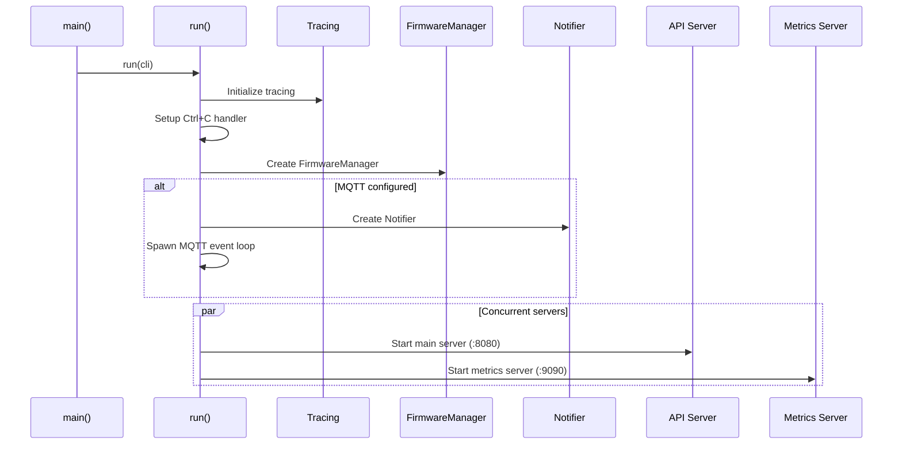
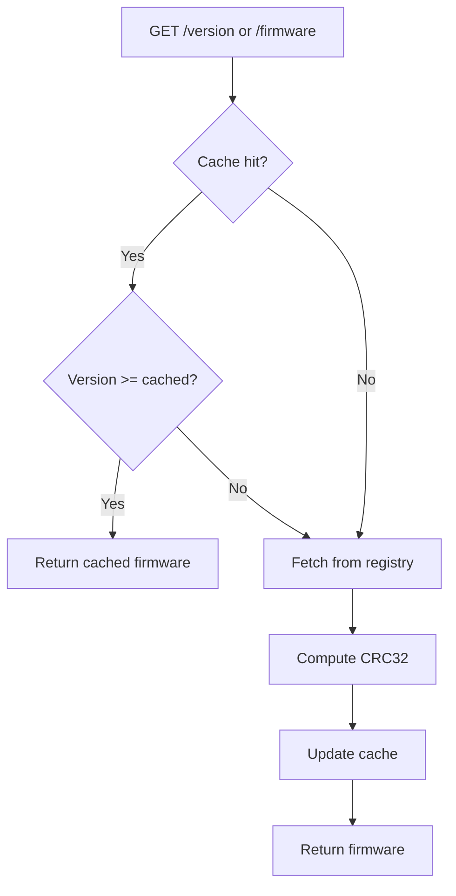
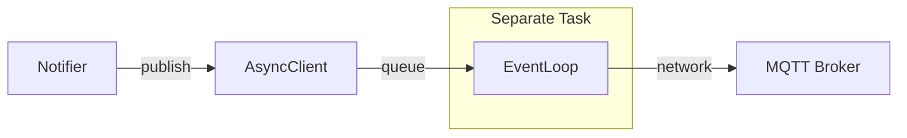
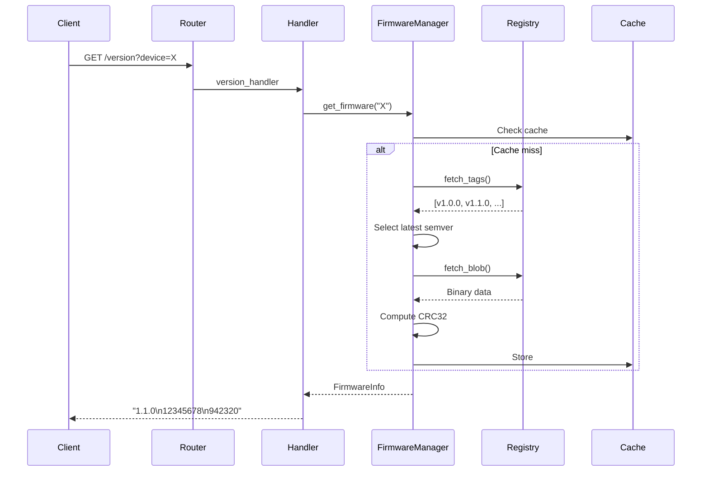
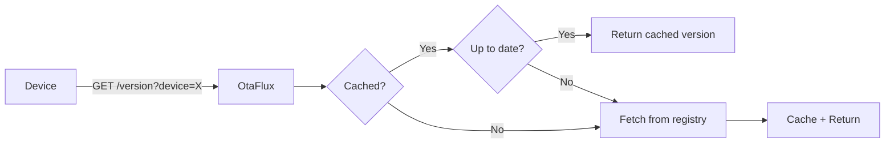
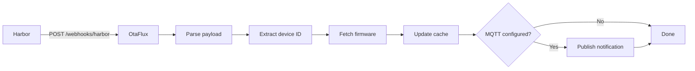
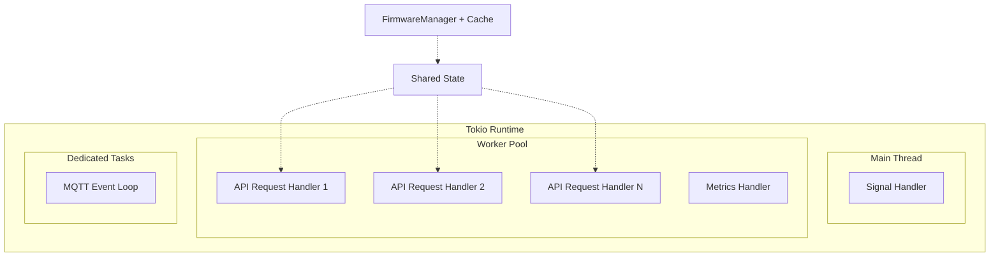

# Architecture

This document describes OtaFlux's internal architecture, component design, and
implementation details.

## System Overview



## Component Architecture

### Main Entry Point

The application starts in `main.rs`, which:

1. Parses CLI arguments using [clap](https://docs.rs/clap)
2. Calls `run()` from `lib.rs` with the configuration

```rust
#[tokio::main]
async fn main() -> Result<()> {
    let cli = Cli::parse();
    run(cli).await
}
```

### Runtime Initialization (`lib.rs`)

The `run()` function orchestrates startup:



Key aspects:
- **Graceful shutdown**: Uses `CancellationToken` for coordinated shutdown
- **Async runtime**: Tokio with full features
- **Concurrent servers**: Main and metrics servers run in parallel

### Firmware Manager

The `FirmwareManager` is the core component responsible for:

- Fetching firmware from OCI registries
- Caching firmware in memory
- Computing CRC32 checksums
- Semver tag resolution

```rust
pub struct FirmwareManager {
    cache: Mutex<HashMap<String, Arc<FirmwareInfo>>>,
    client: Arc<RegistryClient>,
}

pub struct FirmwareInfo {
    pub binary: Vec<u8>,
    pub crc: u32,
    pub version: Version,
    pub size: usize,
}
```

#### Caching Strategy



**Cache characteristics:**

| Property | Value |
|----------|-------|
| Type | In-memory HashMap |
| Key | Device ID (string) |
| Value | `Arc<FirmwareInfo>` |
| Eviction | None (grows unbounded) |
| Persistence | None (lost on restart) |
| Thread safety | `parking_lot::Mutex` |

**Design decisions:**

1. **No TTL**: Cache is invalidated by version comparison, not time
2. **Unbounded growth**: Suitable for bounded device counts; consider LRU for large deployments
3. **Arc wrapping**: Allows zero-copy returns to multiple requests

#### Concurrency Model

The cache uses `parking_lot::Mutex` with careful lock scoping:

```rust
// 1. Lock to check cache (short hold)
let cached = {
    let cache = self.cache.lock();
    cache.get(device_id).cloned()
};

// 2. Fetch outside lock (allows concurrent fetches for different devices)
let blob = self.client.fetch_blob(device_id, &tag).await?;

// 3. Lock to update cache (short hold)
{
    let mut cache = self.cache.lock();
    cache.insert(device_id.to_string(), Arc::clone(&info));
}
```

This pattern:
- Minimizes lock contention
- Allows concurrent registry fetches
- Prevents thundering herd via Arc sharing

### Registry Client

The `RegistryClient` wraps [oci-client](https://docs.rs/oci-client) for OCI
registry interactions:

```rust
pub struct RegistryClient {
    repository: String,      // Base URL + prefix
    username: String,
    password: String,
    insecure: bool,
    cosign_pub_key_path: Option<String>,
}
```

**Operations:**

| Method | Purpose |
|--------|---------|
| `fetch_tags()` | List all tags for a repository |
| `fetch_blob()` | Download the firmware binary |

**Authentication:**
- Basic auth with username/password
- Supports both HTTP and HTTPS registries

### Notifier (MQTT)

The `Notifier` component publishes firmware update notifications:

```rust
pub struct Notifier {
    client: Arc<AsyncClient>,
    topic: String,
}

pub struct TlsConfig {
    pub ca_cert: Vec<u8>,
    pub client_auth: Option<(Vec<u8>, Vec<u8>)>,
}
```

**MQTT Client Architecture:**



The MQTT event loop runs in a dedicated Tokio task, allowing non-blocking publishes.

### API Layer

#### Router Structure

```
/
├── /health          → health_handler
├── /version         → version_handler
├── /firmware        → firmware_handler
└── /webhooks
    └── /harbor      → harbor_webhook_handler
```

**State sharing:**

```rust
pub struct AppState {
    pub firmware_manager: Arc<FirmwareManager>,
    pub notifier: Option<Notifier>,
}
```

State is shared via Axum's `State` extractor, using `Arc` for thread-safe sharing.

#### Request Flow



### Metrics

OtaFlux exposes Prometheus metrics on a separate port:

**Available metrics:**

| Metric | Type | Labels | Description |
|--------|------|--------|-------------|
| `firmware_cache_hit_total` | Counter | `device_id` | Cache hits per device |
| `firmware_cache_miss_total` | Counter | `device_id` | Cache misses per device |

**Implementation:**

```rust
metrics::counter!("firmware_cache_hit_total", &prometheus_labels).increment(1);
```

Uses [metrics-rs](https://docs.rs/metrics) with Prometheus exporter.

## Data Flow

### Version Check Flow



### Webhook Flow



## Thread Model



- **Main thread**: Handles Ctrl+C signal
- **Worker pool**: Tokio's multi-threaded runtime handles HTTP requests
- **MQTT task**: Dedicated spawned task for MQTT event loop
- **Shared state**: Arc-wrapped, mutex-protected where needed

## Error Handling

OtaFlux uses `anyhow` for error propagation:

```rust
pub async fn get_firmware(&self, device_id: &str) -> Result<Arc<FirmwareInfo>>
```

**Error propagation:**

| Layer | Error Handling |
|-------|----------------|
| Registry client | Returns `anyhow::Error` |
| Firmware manager | Propagates with context |
| API handlers | Converts to HTTP status codes |
| Webhook handlers | Logs and returns 200 OK |

**Webhook error philosophy**: Webhooks return 200 OK even on internal errors to
prevent Harbor from retrying. Errors are logged for debugging.

## Dependencies

### Core Dependencies

| Crate | Purpose |
|-------|---------|
| `tokio` | Async runtime |
| `axum` | HTTP framework |
| `oci-client` | OCI registry client |
| `rumqttc` | MQTT client |
| `sigstore` | Cosign verification |
| `semver` | Version parsing |
| `parking_lot` | Fast mutex |

### Serialization

| Crate | Purpose |
|-------|---------|
| `serde` | Serialization framework |
| `serde_json` | JSON support |

### Observability

| Crate | Purpose |
|-------|---------|
| `tracing` | Structured logging |
| `tracing-subscriber` | Log formatting |
| `metrics` | Metrics abstraction |
| `metrics-exporter-prometheus` | Prometheus export |

## Performance Considerations

### Memory Usage

- **Firmware cache**: Unbounded; each entry holds the full binary
- **Recommendation**: For 100 devices × 1MB firmware = ~100MB cache
- **Mitigation**: Consider LRU cache for large deployments

### Concurrency

- **Lock contention**: Minimized by short lock holds
- **Registry fetches**: Concurrent for different devices
- **MQTT publishes**: Non-blocking via async client

### Latency

| Operation | Expected Latency |
|-----------|------------------|
| Cache hit | < 1ms |
| Registry fetch | 100ms - 5s (network-bound) |
| MQTT publish | < 10ms (local broker) |

## Security Model

| Component | Security Measure |
|-----------|------------------|
| Registry auth | Basic auth (username/password) |
| MQTT auth | Username/password + optional mTLS |
| Firmware integrity | Optional Cosign signature verification |
| Transport | TLS for registry and MQTT |
| Secrets | Passed via CLI args or environment variables |

> **Note**: OtaFlux does not implement its own authentication. Secure access
> using reverse proxies, network policies, or service meshes.

## Extensibility

### Adding a New Registry Webhook

1. Create handler in `src/api/webhooks/`
2. Define payload struct with `#[derive(Deserialize)]`
3. Add route in `src/api/router.rs`
4. Call `firmware_manager.get_firmware()` and `notifier.publish()`

### Adding Metrics

```rust
// In your handler
metrics::counter!("my_metric", &[("label", "value")]).increment(1);
```

Metrics are automatically exposed on `/metrics`.

### Adding Configuration Options

1. Add field to `Cli` struct in `lib.rs`
2. Use `#[clap(long, env)]` for CLI and env var support
3. Pass to relevant components during initialization
