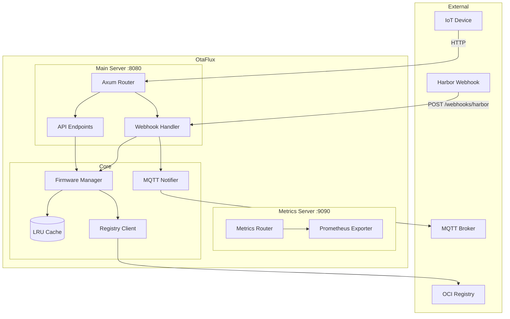

# Architecture

## System Overview

## Caching

OtaFlux uses an LRU (Least Recently Used) cache to store firmware binaries in memory.

- **Default size**: 100 entries (configurable via `--cache-size`)
- **Eviction policy**: When the cache is full, the least recently accessed entry is evicted
- **Cache key**: Device ID (repository name)
- **Cache value**: Firmware binary, version, CRC32, and size

On cache miss, OtaFlux fetches the firmware from the OCI registry and stores it in the cache.
Subsequent requests for the same device are served from cache until evicted.

## Concurrency

- **Thread-safe cache**: Protected by `parking_lot::Mutex` for fast, non-poisoning locks
- **Async I/O**: All registry and MQTT operations use Tokio async runtime
- **Graceful shutdown**: Ctrl+C triggers coordinated shutdown of all servers
