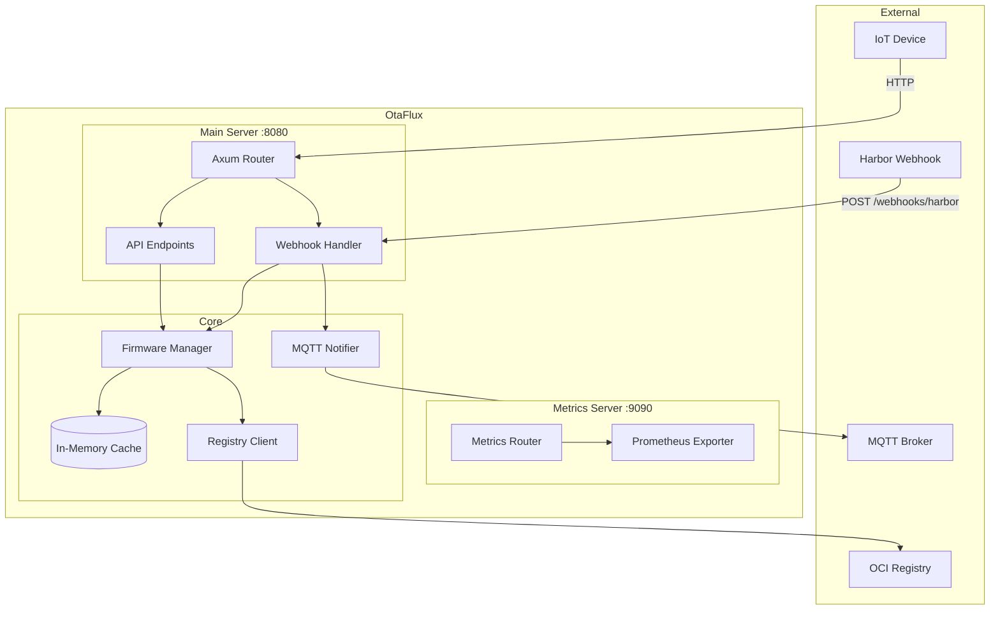

# Architecture

## System Overview

```mermaid
flowchart TB
    subgraph External
        Device[IoT Device]
        Registry[OCI Registry]
        MQTT[MQTT Broker]
        Harbor[Harbor Webhook]
    end

    subgraph OtaFlux
        subgraph "Main Server :8080"
            Router[Axum Router]
            Endpoints[API Endpoints]
            WebhookHandler[Webhook Handler]
        end

        subgraph "Metrics Server :9090"
            MetricsRouter[Metrics Router]
            Prometheus[Prometheus Exporter]
        end

        subgraph Core
            FirmwareManager[Firmware Manager]
            Cache[(In-Memory Cache)]
            RegistryClient[Registry Client]
            Notifier[MQTT Notifier]
        end
    end

    Device -->|HTTP| Router
    Router --> Endpoints
    Router --> WebhookHandler
    
    Harbor -->|POST /webhooks/harbor| WebhookHandler
    
    Endpoints --> FirmwareManager
    WebhookHandler --> FirmwareManager
    WebhookHandler --> Notifier
    
    FirmwareManager --> Cache
    FirmwareManager --> RegistryClient
    RegistryClient --> Registry
    
    Notifier --> MQTT
    
    MetricsRouter --> Prometheus
```
