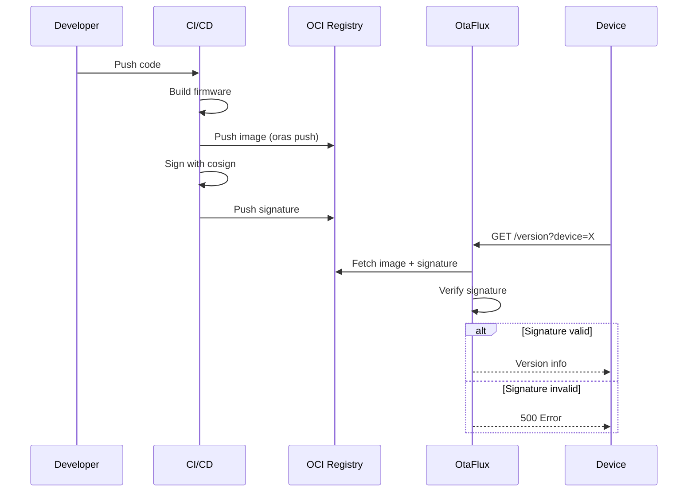

# Firmware Signing with Cosign

OtaFlux verifies firmware signatures using [Cosign][cosign-cli], a Sigstore tool
for signing OCI artifacts. When enabled, OtaFlux rejects unsigned or tampered
images before serving firmware to devices.

## Why Sign Firmware?

OTA updates expose devices to supply-chain attacks. Compromised registries,
man-in-the-middle attacks, or accidental deployment of unverified builds can
brick devices or enable remote code execution.

Cosign provides:

| Benefit | Description |
|---------|-------------|
| **Cryptographic integrity** | Signatures tied to specific image digests |
| **Tamper detection** | Any modification invalidates the signature |
| **Non-repudiation** | Only key holders can sign |
| **Transparency logs** | Optional Rekor integration for audit trails |
| **Standard tooling** | Works with any OCI-compliant registry |

**OtaFlux rejects unsigned or tampered images before serving firmware.**

## Prerequisites

| Tool | Purpose | Installation |
|------|---------|--------------|
| [Cosign CLI][cosign-cli] | Sign and verify images | `brew install cosign` or [releases](https://github.com/sigstore/cosign/releases) |
| [ORAS CLI][oras] | Push OCI artifacts | `brew install oras` or [releases](https://oras.land/docs/installation) |

## Quick Start

### 1. Generate a Key Pair

```bash
cosign generate-key-pair
# Creates: cosign.pub (public key) and cosign.key (private key)
# Leave password empty for CI automation (or use KMS)
```

> **Security**: Store the private key securely (KMS, HSM, or encrypted storage).
> Only your CI/CD pipeline should access it. The public key can be distributed.

### 2. Build and Push Firmware

Build your firmware and push it to an OCI registry:

```bash
# Example: ESP32 firmware
cargo build --release
espflash save-image --chip esp32 \
    ./target/xtensa-esp32-none-elf/release/my-device \
    ./firmware.bin

# Push to registry
oras push "registry.example.com/my-project/my-device:1.0.0" \
    firmware.bin:application/vnd.espressif.esp32.firmware.v1+binary
```

### 3. Sign the Artifact

Sign using the image digest (not the tag):

```bash
# Get the digest
DIGEST=$(oras manifest fetch "registry.example.com/my-project/my-device:1.0.0" \
    --descriptor | jq -r '.digest')

# Sign
cosign sign --key cosign.key \
    "registry.example.com/my-project/my-device@${DIGEST}"
```

### 4. Configure OtaFlux

Provide the public key to enable verification:

```bash
otaflux \
    --registry-url "https://registry.example.com" \
    --repository-prefix "my-project/" \
    --registry-username "username" \
    --registry-password "password" \
    --cosign-pub-key-path "/etc/otaflux/cosign.pub"
```

### 5. Verify It Works

```bash
curl 'localhost:8080/version?device=my-device'
# Returns version, CRC32, size if signature is valid
1.0.0
4051932293
942320
```

If verification fails, OtaFlux returns an error and refuses to serve the firmware.

## Signing Workflow



## CI/CD Integration

### GitHub Actions

```yaml
name: Build and Sign Firmware

on:
  push:
    tags:
      - 'v*'

jobs:
  build-and-sign:
    runs-on: ubuntu-latest
    permissions:
      contents: read
      packages: write
      id-token: write  # For keyless signing (optional)

    steps:
      - uses: actions/checkout@v4

      - name: Set up build environment
        run: |
          # Your toolchain setup (e.g., ESP-IDF, PlatformIO)

      - name: Build firmware
        run: |
          # Your build commands
          cargo build --release
          # Create binary...

      - name: Install Cosign
        uses: sigstore/cosign-installer@v3

      - name: Install ORAS
        uses: oras-project/setup-oras@v1

      - name: Log in to registry
        run: |
          echo "${{ secrets.REGISTRY_PASSWORD }}" | \
            oras login ${{ vars.REGISTRY }} -u ${{ vars.REGISTRY_USERNAME }} --password-stdin

      - name: Push firmware
        id: push
        run: |
          VERSION=${GITHUB_REF#refs/tags/v}
          oras push "${{ vars.REGISTRY }}/${{ vars.REPOSITORY }}:${VERSION}" \
              firmware.bin:application/vnd.espressif.esp32.firmware.v1+binary
          
          DIGEST=$(oras manifest fetch "${{ vars.REGISTRY }}/${{ vars.REPOSITORY }}:${VERSION}" \
              --descriptor | jq -r '.digest')
          echo "digest=${DIGEST}" >> $GITHUB_OUTPUT

      - name: Sign firmware
        env:
          COSIGN_KEY: ${{ secrets.COSIGN_PRIVATE_KEY }}
          COSIGN_PASSWORD: ${{ secrets.COSIGN_PASSWORD }}
        run: |
          echo "$COSIGN_KEY" > cosign.key
          cosign sign --key cosign.key \
              "${{ vars.REGISTRY }}/${{ vars.REPOSITORY }}@${{ steps.push.outputs.digest }}"
          rm cosign.key
```

### GitLab CI

```yaml
build-and-sign:
  stage: deploy
  image: debian:bookworm
  variables:
    COSIGN_VERSION: "2.2.0"
    ORAS_VERSION: "1.1.0"
  before_script:
    - apt-get update && apt-get install -y curl jq
    - curl -sLO https://github.com/sigstore/cosign/releases/download/v${COSIGN_VERSION}/cosign-linux-amd64
    - chmod +x cosign-linux-amd64 && mv cosign-linux-amd64 /usr/local/bin/cosign
    - curl -sLO https://github.com/oras-project/oras/releases/download/v${ORAS_VERSION}/oras_${ORAS_VERSION}_linux_amd64.tar.gz
    - tar -xzf oras_${ORAS_VERSION}_linux_amd64.tar.gz -C /usr/local/bin oras
  script:
    - oras login ${REGISTRY} -u ${REGISTRY_USERNAME} -p ${REGISTRY_PASSWORD}
    - oras push "${REGISTRY}/${REPOSITORY}:${CI_COMMIT_TAG}" firmware.bin:application/octet-stream
    - DIGEST=$(oras manifest fetch "${REGISTRY}/${REPOSITORY}:${CI_COMMIT_TAG}" --descriptor | jq -r '.digest')
    - echo "${COSIGN_PRIVATE_KEY}" > cosign.key
    - cosign sign --key cosign.key "${REGISTRY}/${REPOSITORY}@${DIGEST}"
  only:
    - tags
```

## Key Management

### Key Storage Options

| Option | Security | Complexity | Use Case |
|--------|----------|------------|----------|
| File-based | Low | Low | Development, testing |
| GitHub Secrets | Medium | Low | CI/CD pipelines |
| AWS KMS | High | Medium | Production workloads |
| Google Cloud KMS | High | Medium | GCP environments |
| Azure Key Vault | High | Medium | Azure environments |
| HashiCorp Vault | High | High | Multi-cloud, enterprise |

### Using KMS (Recommended for Production)

```bash
# AWS KMS
cosign generate-key-pair --kms awskms:///alias/cosign-key

# Sign with KMS
cosign sign --key awskms:///alias/cosign-key \
    registry.example.com/project/device@sha256:...

# GCP KMS
cosign generate-key-pair --kms gcpkms://projects/PROJECT/locations/LOCATION/keyRings/RING/cryptoKeys/KEY

# Azure Key Vault
cosign generate-key-pair --kms azurekms://VAULT_NAME.vault.azure.net/keys/KEY_NAME
```

### Key Rotation

When rotating keys:

1. **Generate new key pair**
   ```bash
   cosign generate-key-pair --output-key-prefix cosign-v2
   ```

2. **Update OtaFlux** with the new public key
   ```bash
   otaflux --cosign-pub-key-path /etc/otaflux/cosign-v2.pub ...
   ```

3. **Re-sign existing images** (if needed)
   ```bash
   cosign sign --key cosign-v2.key registry/project/device@sha256:...
   ```

4. **Securely delete old private key**

> **Note**: OtaFlux currently supports a single public key. For multi-key
> verification, you would need to rotate keys during a maintenance window.

## Keyless Signing (Experimental)

Cosign supports keyless signing using OIDC identity providers:

```bash
# Sign with GitHub Actions OIDC
cosign sign --oidc-issuer https://token.actions.githubusercontent.com \
    registry.example.com/project/device@sha256:...
```

> **Note**: OtaFlux currently requires a public key file. Keyless verification
> is not yet supported.

## Troubleshooting

### Verification Errors

| Error | Cause | Solution |
|-------|-------|----------|
| `no matching signatures found` | Image not signed | Sign the image with `cosign sign` |
| `signature verification failed` | Wrong public key | Verify you're using the matching key pair |
| `failed to verify` | Signature for different digest | Re-sign after any image modification |
| `public key not found` | Missing key file | Check `--cosign-pub-key-path` path |

### Debug Verification

Test signature verification manually:

```bash
# Verify with cosign CLI
cosign verify --key cosign.pub \
    registry.example.com/project/device@sha256:...

# Check signature exists
cosign tree registry.example.com/project/device:1.0.0
```

### Common Issues

**1. Signing with tag instead of digest**

```bash
# WRONG - tag can be moved
cosign sign --key cosign.key registry/project/device:1.0.0

# CORRECT - digest is immutable
cosign sign --key cosign.key registry/project/device@sha256:abc123...
```

**2. Pushing new image without re-signing**

If you push a new image with the same tag, you must re-sign it:

```bash
oras push registry/project/device:1.0.0 new-firmware.bin:...
DIGEST=$(oras manifest fetch registry/project/device:1.0.0 --descriptor | jq -r '.digest')
cosign sign --key cosign.key registry/project/device@${DIGEST}
```

**3. Public key format**

OtaFlux expects a PEM-formatted public key:

```
-----BEGIN PUBLIC KEY-----
MFkwEwYHKoZIzj0CAQYIKoZIzj0DAQcDQgAE...
-----END PUBLIC KEY-----
```

### Enable Debug Logging

```bash
otaflux --log-level debug --cosign-pub-key-path cosign.pub ...
```

Look for signature verification logs.

## Docker/Podman Deployment

Mount the public key as a volume:

```bash
podman run -ti --rm \
    -v $PWD/cosign.pub:/etc/otaflux/cosign.pub:ro \
    -p 8080:8080 \
    -p 9090:9090 \
    ghcr.io/etiennetremel/otaflux \
        --registry-url "https://registry.example.com" \
        --repository-prefix "my-project/" \
        --registry-username "username" \
        --registry-password "password" \
        --cosign-pub-key-path "/etc/otaflux/cosign.pub"
```

## Kubernetes Deployment

### Using Helm

```yaml
# values.yaml
otaflux:
  cosignPubKey: |
    -----BEGIN PUBLIC KEY-----
    MFkwEwYHKoZIzj0CAQYIKoZIzj0DAQcDQgAE...
    -----END PUBLIC KEY-----
```

### Using Secrets

```yaml
apiVersion: v1
kind: Secret
metadata:
  name: otaflux-cosign
type: Opaque
data:
  cosign.pub: <base64-encoded-public-key>
---
apiVersion: apps/v1
kind: Deployment
metadata:
  name: otaflux
spec:
  template:
    spec:
      containers:
        - name: otaflux
          args:
            - --cosign-pub-key-path=/etc/otaflux/cosign.pub
          volumeMounts:
            - name: cosign
              mountPath: /etc/otaflux
              readOnly: true
      volumes:
        - name: cosign
          secret:
            secretName: otaflux-cosign
```

## Best Practices

1. **Always sign with digest** - Tags are mutable; digests are not
2. **Use KMS in production** - Don't store private keys as files
3. **Automate in CI/CD** - Human signing is error-prone
4. **Rotate keys periodically** - Especially if team members leave
5. **Verify before deploy** - Test signature verification in staging
6. **Monitor failures** - Alert on signature verification errors
7. **Keep public keys versioned** - Store in source control or secret manager

<!-- page links -->
[cosign-cli]: https://docs.sigstore.dev/cosign/system_config/installation/
[espflash]: https://github.com/esp-rs/espflash
[oras]: https://oras.land
