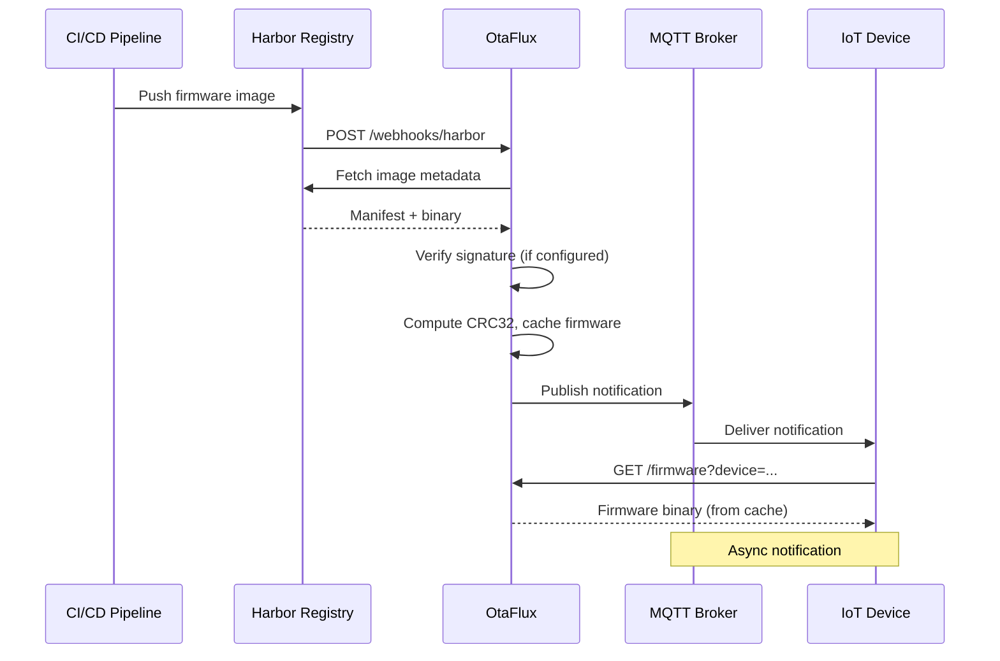

# Harbor Webhook Integration

OtaFlux receives webhooks from Harbor to trigger immediate firmware fetching and
MQTT notifications when new images are pushed. This eliminates polling and
enables real-time update notifications.

## Overview



## Harbor Setup

### Step 1: Navigate to Webhooks

1. Log in to Harbor
2. Go to your project (e.g., `my-project`)
3. Click **Webhooks** tab
4. Click **+ New Webhook**

### Step 2: Configure the Webhook

| Field | Value |
|-------|-------|
| **Name** | OtaFlux Notifications |
| **Description** | Trigger OtaFlux on firmware push |
| **Notify Type** | HTTP |
| **Event Type** | Artifact pushed |
| **Endpoint URL** | `http://otaflux:8080/webhooks/harbor` |
| **Auth Header** | *(optional, see Security section)* |
| **Verify Remote Certificate** | Enable if using HTTPS |

### Step 3: Test the Webhook

1. Click **Test Endpoint** to verify connectivity
2. Push a test image to trigger a real webhook
3. Check OtaFlux logs for confirmation

## Webhook Payload

OtaFlux expects the standard Harbor webhook format for `PUSH_ARTIFACT` events:

```json
{
  "type": "PUSH_ARTIFACT",
  "occur_at": 1704067200,
  "operator": "admin",
  "event_data": {
    "resources": [
      {
        "digest": "sha256:abc123def456...",
        "tag": "1.0.0",
        "resource_url": "registry.example.com/my-project/esp32-sensor:1.0.0"
      }
    ],
    "repository": {
      "date_created": 1704067000,
      "name": "esp32-sensor",
      "namespace": "my-project",
      "repo_full_name": "my-project/esp32-sensor",
      "repo_type": "private"
    }
  }
}
```

### Payload Fields

| Field | Description |
|-------|-------------|
| `type` | Event type (only `PUSH_ARTIFACT` is processed) |
| `occur_at` | Unix timestamp of the event |
| `operator` | User who triggered the push |
| `event_data.resources[].tag` | Image tag (used for version) |
| `event_data.resources[].digest` | Image digest for verification |
| `event_data.repository.name` | Device/repository name |
| `event_data.repository.namespace` | Project namespace |

## Supported Events

| Event Type | Action |
|------------|--------|
| `PUSH_ARTIFACT` | Fetch firmware, update cache, publish MQTT notification |
| Other events | Logged and ignored |

## Workflow Details

When OtaFlux receives a `PUSH_ARTIFACT` webhook:

1. **Parse payload** - Extract repository name and tag
2. **Fetch firmware** - Pull the latest image from the registry
3. **Verify signature** - If Cosign is configured, verify the signature
4. **Cache firmware** - Store binary with CRC32 and metadata
5. **Publish notification** - Send MQTT message (if configured)
6. **Return 200 OK** - Acknowledge the webhook

## Security

### Harbor Authentication Headers

Harbor supports custom authentication headers. Configure them in Harbor's
webhook settings and validate them in your reverse proxy.

### TLS/HTTPS

Always use HTTPS in production:

1. Terminate TLS at your ingress/load balancer
2. Enable "Verify Remote Certificate" in Harbor webhook settings
3. Use valid certificates (not self-signed) for easier configuration

## Error Handling

### Webhook Response Codes

| Code | Meaning | Harbor Behavior |
|------|---------|-----------------|
| `200 OK` | Success | Mark delivery successful |
| `4xx` | Client error | Mark delivery failed, no retry |
| `5xx` | Server error | Retry with exponential backoff |

### OtaFlux Error Scenarios

| Scenario | Log Message | Response |
|----------|-------------|----------|
| Successful processing | `Successfully published firmware notification` | 200 OK |
| Firmware fetch failed | `Failed to get firmware for device` | 200 OK (logged) |
| MQTT not configured | `No notifier configured` | 200 OK (logged) |
| Invalid payload | `Failed to parse webhook` | 400 Bad Request |

> **Note**: OtaFlux returns 200 OK even for some errors to prevent Harbor from
> retrying. Check logs for detailed error information.

## Testing

Send a test webhook using curl:

```bash
curl -X POST http://localhost:8080/webhooks/harbor \
  -H "Content-Type: application/json" \
  -d '{
    "type": "PUSH_ARTIFACT",
    "occur_at": 1704067200,
    "operator": "admin",
    "event_data": {
      "resources": [{
        "digest": "sha256:abc123",
        "tag": "1.0.0",
        "resource_url": "registry/project/device:1.0.0"
      }],
      "repository": {
        "date_created": 1704067000,
        "name": "esp32-sensor",
        "namespace": "my-project",
        "repo_full_name": "my-project/esp32-sensor",
        "repo_type": "private"
      }
    }
  }'
```
