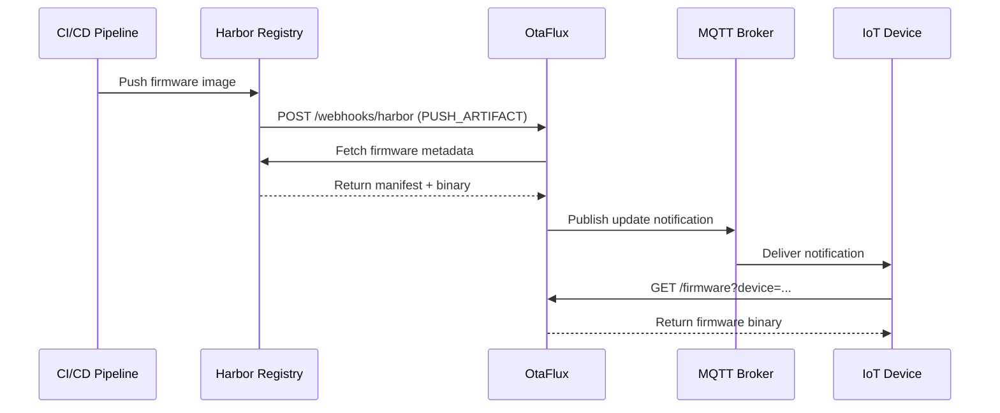

# Harbor Webhook Integration

OtaFlux can receive webhooks from Harbor registry to trigger immediate firmware
fetching and MQTT notifications when new images are pushed.

## Setting up Harbor Webhook

1. In Harbor, navigate to your project settings
2. Go to **Webhooks** and click **New Webhook**
3. Configure the webhook:
   - **Name**: OtaFlux Notifications
   - **Notify Type**: HTTP
   - **Event Type**: Select `Artifact pushed`
   - **Endpoint URL**: `http://otaflux:8080/webhooks/harbor`
4. Save the webhook

## Workflow

When a new firmware image is pushed to Harbor:



1. Harbor sends a `PUSH_ARTIFACT` webhook to OtaFlux
2. OtaFlux fetches the firmware metadata from the registry
3. If MQTT is configured, OtaFlux publishes an update notification
4. Subscribed devices receive the notification and can initiate an update

## Webhook Payload

OtaFlux expects the standard Harbor webhook payload format:

```json
{
  "type": "PUSH_ARTIFACT",
  "occur_at": 1234567890,
  "operator": "admin",
  "event_data": {
    "resources": [
      {
        "digest": "sha256:abc123...",
        "tag": "1.0.0",
        "resource_url": "registry.example.com/project/device:1.0.0"
      }
    ],
    "repository": {
      "date_created": 1234567890,
      "name": "device",
      "namespace": "project",
      "repo_full_name": "project/device",
      "repo_type": "private"
    }
  }
}
```

## Supported Events

Currently, OtaFlux only processes `PUSH_ARTIFACT` events. Other event types
(like `DELETE_ARTIFACT`, `SCANNING_COMPLETED`, etc.) are logged and ignored.

## Security Considerations

- Consider placing OtaFlux behind a reverse proxy with authentication for the
  webhook endpoint
- Harbor supports webhook authentication headers which can be validated by your
  proxy
- Use HTTPS in production environments
